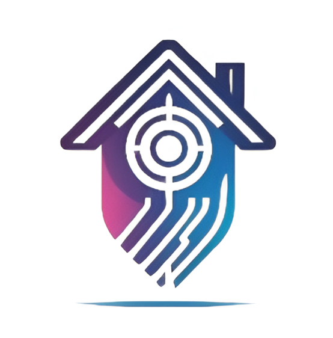

# 🏠 HomeTech - Smart Home Control


**HomeTech** is a comprehensive smart home IoT management application developed with Flutter. It integrates real-time control of devices, sensor monitoring, and secure authentication to provided a seamless home automation experience.

---

### 📱 Live Demo (Web)

Try the interactive mobile preview directly in your browser:
**[👉 Launch HomeTech Web Demo](https://hometech-demouser.netlify.app/)**

> **Note:** The web version features a unique responsive design. On desktop, it simulates a mobile device frame. On mobile devices, it adapts to a native full-screen experience.

---

## ✨ Features

- **💡 Lighting Control**: Real-time toggling and intensity adjustment for multiple rooms.
- **🚪 Motor & Access**: Garage door control with status visualization.
- **🌡️ Sensors Dashboard**: Monitoring of Gas, Proximity, and Movement sensors.
- **🔐 Secure Authentication**: Powered by Firebase Auth, including Google Sign-In support.
- **🌓 Dark/Light Mode**: Fully themeable UI with persistent user preference.
- **📱 Responsive Web Design**: Custom "Device Frame" wrapper for desktop browsers to simulate mobile UX.

## 🛠️ Tech Stack

- **Frontend**: Flutter (Mobile & Web)
- **Backend/Database**: Firebase Realtime Database & Firestore
- **Authentication**: Firebase Auth
- **State Management**: Provider

## 📸 Screenshots

|                         Dashboard (Dark)                          |                          Devices Control                          |                        Mobile Web Preview                         |
| :---------------------------------------------------------------: | :---------------------------------------------------------------: | :---------------------------------------------------------------: |
|  |  |  |

_(Screenshots to be added)_

## 🚀 Getting Started

To run this project locally:

1.  **Clone the repository:**

    ```bash
    git clone https://github.com/LiraU13/HomeTech.git
    cd HomeTech
    ```

2.  **Install dependencies:**

    ```bash
    flutter pub get
    ```

3.  **Run the app:**
    ```bash
    flutter run
    ```

## 📄 License

This project is licensed under the MIT License - see the LICENSE file for details.

---

Developed by [LiraU13](https://github.com/LiraU13)
